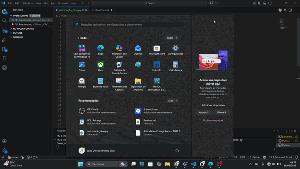

# 🦖 Dino Bot - Chrome

Bot em Python que joga automaticamente o jogo do dinossauro do Google Chrome usando PyAutoGUI.

## 🚀 Tecnologias
- Python
- PyAutoGUI
- Pillow

## 🎮 Como usar
1. Abra o jogo do Dino no Chrome
2. Execute o script
3. Aguarde 3 segundos
4. O bot começará a jogar sozinho

## ⚠️ Aviso
A automação depende da resolução da tela.
Pode ser necessário ajustar as coordenadas da região analisada.

## 🎮 Demonstração

